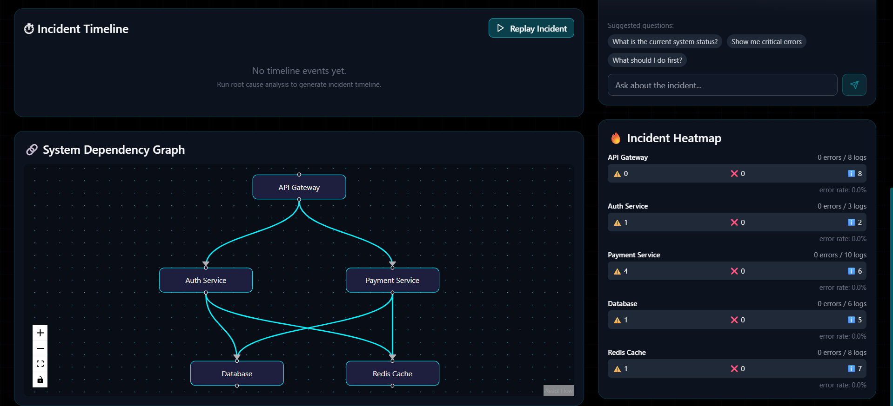
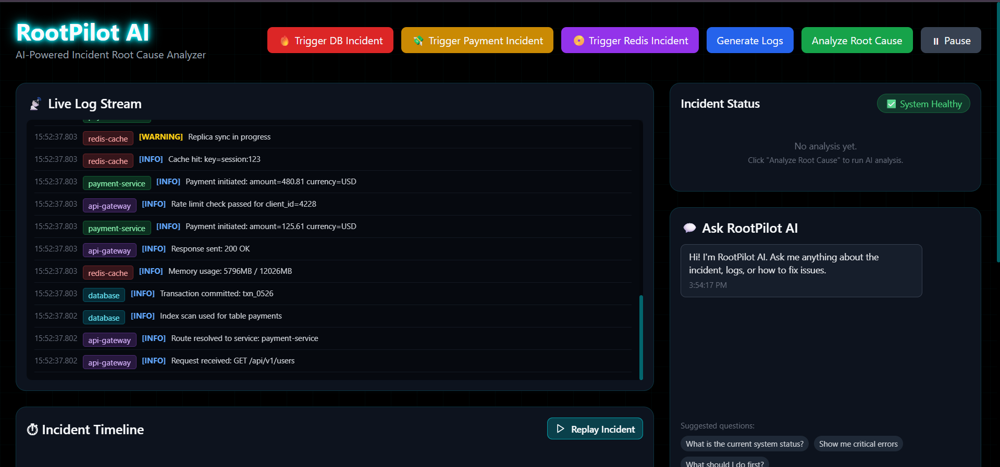

# RootPilot AI - Incident Root Cause Analyzer

AI-powered incident intelligence for SRE teams. Detect, explain, and prevent system failures.

## Features

- Real-time log streaming with service and severity badges
- Root cause analysis with confidence scoring
- Incident timeline reconstruction
- Interactive dependency graph
- Natural language incident chat
- Fix recommendations and incident heatmap
- Incident replay mode for post-mortems

## Architecture

- Frontend: Next.js 14, TypeScript, Tailwind CSS, React Flow, Recharts
- Backend: FastAPI, Python 3.12, Gemini/OpenAI-compatible analysis with local fallback
- Simulation: Mock log generator with incident triggers

## Quick Start

### Backend

```bash
cd backend
python -m venv venv
.\venv\Scripts\activate
pip install -r requirements.txt
copy .env.example .env
python run.py
```

Backend runs at `http://localhost:8000`.

### Frontend

```bash
cd frontend
npm install
npm run dev
```

Frontend runs at `http://localhost:3000`.

## Useful Checks

```bash
cd frontend
npm run typecheck
npm run lint
npm run build
```

```bash
cd backend
.\venv\Scripts\python.exe -m compileall app run.py -q
```

## Demo Flow

1. Start the backend and frontend.
2. Click `Generate Logs`.
3. Trigger one of the demo incidents.
4. Click `Analyze Root Cause`.
5. Review the timeline, dependency graph, confidence ranking, heatmap, and chat panel.

## Project Structure

```text
rootpilot-ai/
  backend/
    app/
      main.py
      config.py
      models.py
      routes/
      services/
      utils/
    requirements.txt
    .env.example
    run.py
  frontend/
    app/
      components/
      lib/
      page.tsx
      globals.css
    package.json
    tailwind.config.js
```
Output:
 ,  